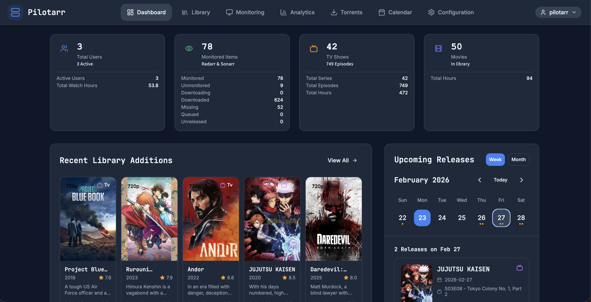
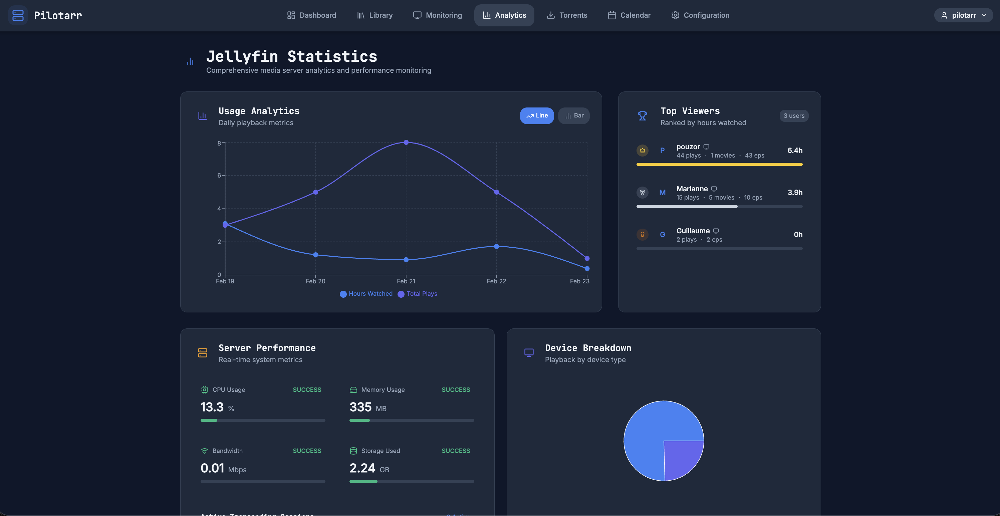

# Pilotarr

A full-stack dashboard for managing your home media server stack. Pilotarr provides a unified interface to monitor and control **Radarr**, **Sonarr**, **qBittorrent**, **Jellyfin**, and **Jellyseerr** from a single place.




## Features

- **Unified Dashboard** - Overview of all services with stats, recent additions, and upcoming releases
- **Library Management** - Browse and filter your media library (movies & TV shows)
- **Jellyseerr Requests** - View and manage media requests
- **Torrent Monitoring** - Track active downloads and torrent status
- **Jellyfin Analytics** - Usage charts, device breakdown, user stats, and server performance
- **Calendar** - Upcoming releases from Radarr and Sonarr
- **Alerts** - Notifications and alert history across services
- **Auto-Sync** - Background scheduler syncs data from all services every 15 minutes

## Tech Stack

| Layer      | Technology                                            |
| ---------- | ----------------------------------------------------- |
| Backend    | Python 3, FastAPI, SQLAlchemy, Pydantic               |
| Frontend   | React 18 (JSX), Vite, Tailwind CSS, Redux Toolkit     |
| Database   | MySQL (PyMySQL driver)                                |
| Charts     | Recharts, D3                                          |
| HTTP       | Axios (frontend), HTTPX / aiohttp (backend)           |
| Scheduling | APScheduler                                           |
| Deployment | Docker / Docker Compose                               |

## Prerequisites

- **Python 3.10+**
- **Node.js 18+**
- **MySQL** (or MariaDB) instance
- (Optional) **Docker** & **Docker Compose**

## Installation

### 1. Clone the repository

```bash
git clone <repo-url>
cd pilotarr
```

### 2. Backend setup

```bash
cd backend

# Create and activate a virtual environment
python -m venv venv
source venv/bin/activate  # Linux/macOS
# venv\Scripts\activate   # Windows

# Install dependencies
pip install -r requirements.txt
```

Create a `.env` file in `backend/` with the following variables:

```env
# Database
DB_HOST=localhost
DB_PORT=3306
DB_USER=your_db_user
DB_PASSWORD=your_db_password
DB_NAME=pilotarr

# Security
SECRET_KEY=your_secret_key

#API KEY FOR Jellyfin (needed for playback session)
API_KEY=your_api_key

# Jellyfin
JELLYFIN_PUBLIC_URL=http://your-jellyfin-url
```

Start the backend:

```bash
uvicorn app.main:app --reload
```

The API is available at `http://localhost:8000` with interactive docs at `http://localhost:8000/docs`.

### 3. Frontend setup

```bash
cd frontend

# Install dependencies
npm install

# Start the dev server
npm start
```

The frontend is available at `http://localhost:5173`.

### 4. Docker — full stack (recommended)

A single `docker-compose.yml` at the repo root orchestrates everything:
MySQL + backend (FastAPI) + frontend (React served by nginx).

```bash
# 1. Copy and fill in your secrets (single file at the root — used by all services)
cp .env.example .env
# Edit .env: set DB_PASSWORD, MYSQL_ROOT_PASSWORD, SECRET_KEY, API_KEY, etc.

# 2. Build and start all services
docker-compose up -d --build

# 3. Check logs
docker-compose logs -f
```

> **Important:** The `.env` file **must be at the repository root** (next to `docker-compose.yml`). Docker Compose reads it automatically and injects the same credentials into both MySQL and the backend — keeping them in sync. A `backend/.env` file is only used for local development (without Docker).

The app is available at `http://localhost` (or the port set by `PILOTARR_PORT`).

| Service | Internal address | Exposed |
|---|---|---|
| Frontend (nginx) | — | `:80` (configurable via `PILOTARR_PORT`) |
| Backend (FastAPI) | `http://backend:8000` | not exposed externally |
| MySQL | `mysql:3306` | not exposed externally |

> **Note:** `VITE_PILOTARR_API_URL` is baked in as `/api` at build time. Nginx proxies
> all `/api/*` requests to the backend container — no hardcoded IPs in the JS bundle.

#### Useful commands

```bash
docker-compose down          # stop all
docker-compose down -v       # stop + delete MySQL volume (wipes DB)
docker-compose build --no-cache  # force full rebuild
docker-compose logs backend  # backend logs only
```

#### Dev mode (hot-reload)

For local development with file watching, use the backend-only compose:

```bash
cd backend && docker-compose up   # backend + MySQL with --reload
cd frontend && npm start          # Vite dev server on :4028
```

## Jellyfin Integration

Pilotarr receives real-time playback events from Jellyfin via webhooks. This powers the analytics page (user leaderboard, usage charts, session history) and automatically marks episodes/movies as watched.

Two Jellyfin plugins are required.

### Required plugins

#### 1. Jellyfin Webhook plugin

Sends playback events (play, pause, resume, stop) to Pilotarr in real time.

**Install:**
1. In Jellyfin, go to **Dashboard > Plugins > Catalog**
2. Search for **Webhook** and install it
3. Restart Jellyfin

**Configure:**
1. Go to **Dashboard > Plugins > Webhook**
2. Click **Add** to create a new webhook
3. Set the following:
   - **URL**: `http://<pilotarr-host>:8000/api/analytics/webhook/playback?apiKey=<your_api_key>`
   - **Notification type**: check all playback events — `Play`, `Pause`, `Resume`, `Stop`
   - **Send All Properties**: enabled
4. Save

The `apiKey` must match the `API_KEY` value in your backend `.env`.

> If you configured a `WEBHOOK_SECRET` in `.env`, also add the header `X-Webhook-Secret: <your_secret>` in the webhook plugin settings.

#### 2. Playback Reporting plugin

Stores detailed playback history on the Jellyfin side (used to compute watched duration, enabling the 30%-threshold auto-mark-as-watched logic in Pilotarr).

**Install:**
1. In Jellyfin, go to **Dashboard > Plugins > Catalog**
2. Search for **Playback Reporting** and install it
3. Restart Jellyfin

No additional configuration is needed — the plugin activates automatically and Pilotarr reads the data through the webhook events.

### How it works

| Event | What Pilotarr does |
|---|---|
| `Play` | Opens a playback session, links it to a library item |
| `Pause` / `Resume` | Updates session state |
| `Stop` | Closes the session; if >= 30% watched, marks the episode/movie as watched |

## Project Structure

```
pilotarr/
├── backend/
│   ├── app/
│   │   ├── api/routes/      # API route handlers
│   │   ├── core/            # Configuration & security
│   │   ├── models/          # SQLAlchemy models
│   │   ├── schedulers/      # Background tasks (APScheduler)
│   │   └── services/        # Service connectors (Radarr, Sonarr, etc.)
│   ├── docker-compose.yml
│   └── requirements.txt
├── frontend/
│   ├── src/
│   │   ├── components/      # Shared UI components
│   │   ├── contexts/        # React context providers
│   │   ├── pages/           # Page components (folder per feature)
│   │   ├── services/        # API client services
│   │   └── utils/           # Utility functions
│   └── package.json
└── README.md
```

## License

This project is for personal / self-hosted use.
